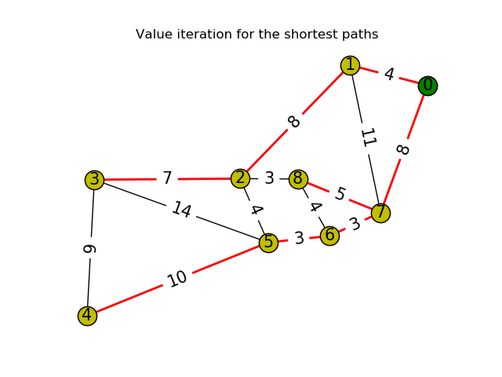
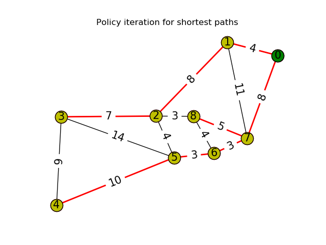

DP and RL algorithms for shortest path planning

## Requirements

- numpy
- networkx
- matplotlib
- imageio (**optional**, useful for generating the video/gif file to visualize)
- imageio-ffmpeg (**optional**, useful for generating the video/gif file to visualize)

To install them, try:

    $ pip3 install numpy networkx matplotlib imageio imageio-ffmpeg  

## Notes

- Please define the adjacent matrix for your problem. **Note that** the first row and the first column **must** correspond to the target state/node. 
- You may need to modify the parameters of the reinforcement learning algorithms in order to solve your problem more effectively.

## Examples
Here, we define the adjacent matrix as follows:

```python3
D = [[0, 4, 0, 0, 0, 0, 0, 8, 0],
     [4, 0, 8, 0, 0, 0, 0, 11, 0],
     [0, 8, 0, 7, 0, 4, 0, 0, 3],
     [0, 0, 7, 0, 9, 14, 0, 0, 0],
     [0, 0, 0, 9, 0, 10, 0, 0, 0],
     [0, 0, 4, 14, 10, 0, 3, 0, 0],
     [0, 0, 0, 0, 0, 3, 0, 3, 4],
     [8, 11, 0, 0, 0, 0, 3, 0, 5],
     [0, 0, 3, 0, 0, 0, 4, 5, 0]]
```
So the graph is as follows:


### 1. value iteration
To run **value iteration** algorithm, run:

	$ python shortest_path.py -s vi
or

	$ python shortest_path.py -s value_iteration 

The result is as follows:



### 2. policy iteration
To run **policy iteration** algorithm, run:

	$ python shortest_path.py -s pi
or

	$ python shortest_path.py -s policy_iteration 

The result is as follows:



### 3. Sarsa
The start node has been set to node 3 in the code.
To run **Sarsa** algorithm, run:

	$ python shortest_path.py -s sarsa

The result is as follows:


### 4. Sarsa(&lambda;)
The start node has been set to node 3 in the code.
To run **Sarsa(&lambda;)** algorithm, run:

	$ python shortest_path.py -s sarsa(lambda)
or

	$ python shortest_path.py -s sarsa_lambda

The result is as follows:


### 5. q-learning
The start node has been set to node 3 in the code.
To run **q-learning** algorithm, run:

	$ python shortest_path.py -s q-learning

The result is as follows:


## More details 
More details can be seen in the code. You can also change the start node for **Sarsa**, **Sarsa(&lambda;)** and **q-learning** algorithm.
